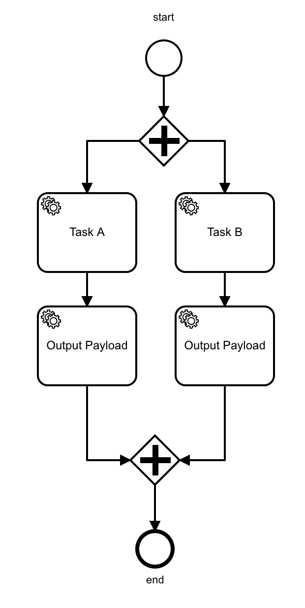
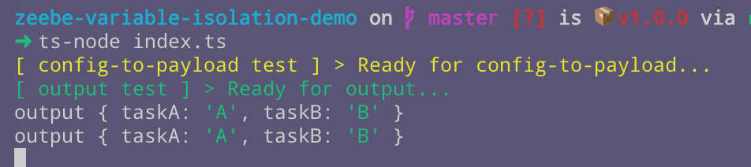
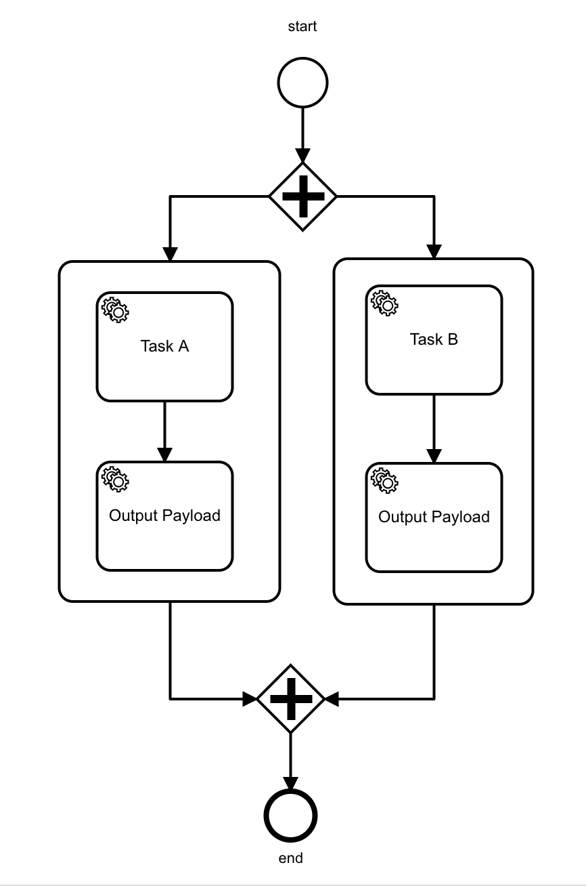
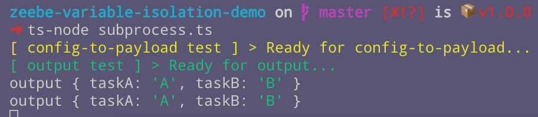
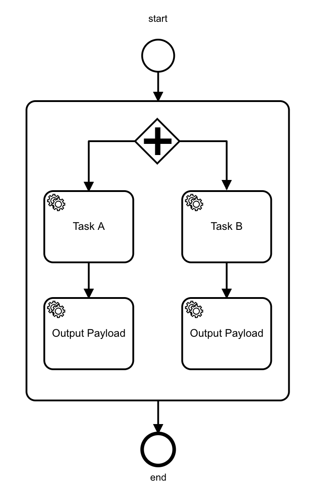
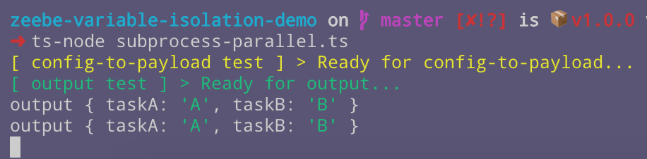

# Zeebe Variable Isolation Demo

Demonstrates isolation between variables in task payloads.

## To run

- Clone this repo.

- Install dependencies:

```bash
npm i
```

Install TypeScript support:

```bash
npm i -g ts-node typescript
```

## The Problem

Given this process:



Where Task A and Task B have distinct values in their custom headers that are used to complete the task like this:

```
complete(job.customHeaders)
```

To run:

```bash
ts-node index.ts
```

When the output task logs the payload, each parallel task has the same variable payload:



You might expect to see two different outputs, one in each parallel branch of the split, with distinct payloads.

Why is the payload the same between each parallel branch?

## The Cause

The same variables are visible in each of the parallel pathways because they are created in the global scope for the workflow. Variable scoping is described in the Zeebe documentation [here](https://docs.zeebe.io/reference/variables.html).

## Using parallel subprocesses to isolate variables to local scope

Putting the branches into parallel subprocesses, like this:



Does _not_ work.

To run this test:

```bash
ts-node parallel-subprocesses.ts
```

The variables are still created in the global scope and visible in each branch:



## Using a subprocess with parallel branches

Now let's try putting the parallel branches in the same sub-process and see how that behaves:



To run:

```bash
ts-node subprocess-parallel.ts
```

The output is the same:


