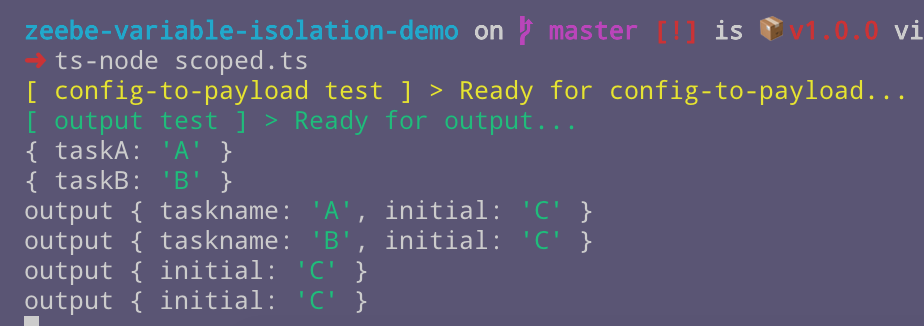

# Zeebe Variable Isolation Demo

Demonstrates isolation between variables in task payloads.

## To run

- Clone this repo.

- Install dependencies:

```bash
npm i
```

Install TypeScript support:

```bash
npm i -g ts-node typescript
```

## The Problem

Given this process:


Where Task A and Task B have distinct values in their custom headers that are used to complete the task like this:

```
complete(job.customHeaders)
```

To run:

```bash
ts-node index.ts
```

When the output task logs the payload, each parallel task has the same variable payload:


You might expect to see two different outputs, one in each parallel branch of the split, with distinct payloads.

Why is the payload the same between each parallel branch?

## The Cause

The same variables are visible in each of the parallel pathways because they are created in the global scope for the workflow. Variable scoping is described in the Zeebe documentation [here](https://docs.zeebe.io/reference/variables.html).

## Using parallel subprocesses to isolate variables to local scope

According to the [docs on Variable Scopes](https://docs.zeebe.io/reference/variables.html#variable-scopes):

> When the workflow instance enters a sub process or an activity then a new scope is created. Activities in this scope can see all variables of this and of higher scopes (i.e. parent scopes). _But activities outside of this scope can not see the variables which are defined in this scopes._

Putting the branches into parallel subprocesses, like this:


Does _not_ work.

To run this test:

```bash
ts-node parallel-subprocesses.ts
```

The variables are still created in the global scope and visible in each branch:


According to [the docs](https://docs.zeebe.io/reference/variables.html#variable-scopes):

> The scope of a variable is defined when the variable is created. _By default, variables are created in the root scope._

OK, so how do I create a locally-scoped variable?

Variables of local scope must be defined via an input parameter mapping in the sub-process.

According to the docs:

> When an input mapping is applied then it creates a new variable in the scope where the mapping is defined.

This is the way to create a local variable. Explicitly map some input variable to a new variable.

Note that the docs also state:

> But if a variable or a nested property of a source expression doesn't exist then an incident is created.

So you must declare and supply an initial value for a local variable.

In programming terms, it is like declaring and initialising a global variable, and then passing it (by value) as an argument to a locally-scoped function.

Within the function, the argument passed in is assigned to a mutable variable that is scoped to the function scope.

A sub-process is like a scoped function. The input mappings is like the parameter list of the function signature.

The return is similar. In a subprocess, all locally-scoped variables are lost at the end of the sub-process, unless they have an output mapping. Think of it as the return signature of the subprocess.

> But output mappings can be used to propagate local variables of the sub process to higher scopes. By default, all local variables are removed when the scope is left.

## Using input mappings on subprocesses to isolate (create local) variables

This test has an input mapping that I expect to create a local variable `taskname` in each subprocess:


Run it with:

```bash
ts-node scoped.ts
```

However, the `taskname` variable is not local to the subprocess and isolated from other subprocesses:


